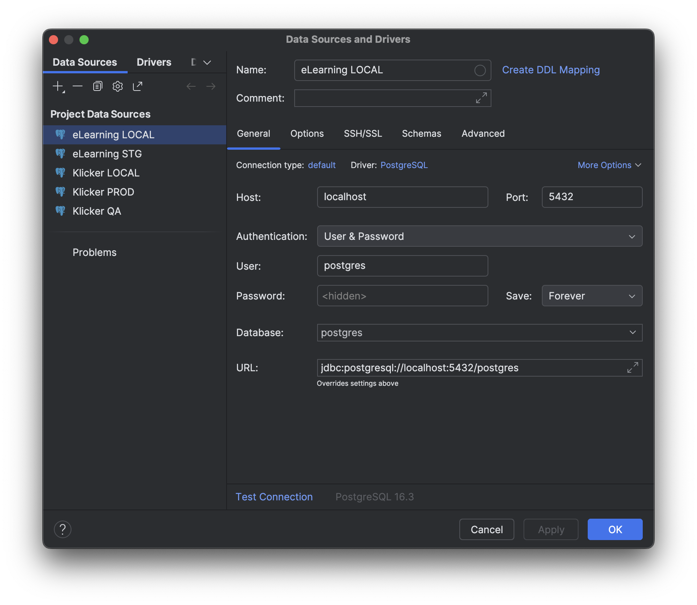
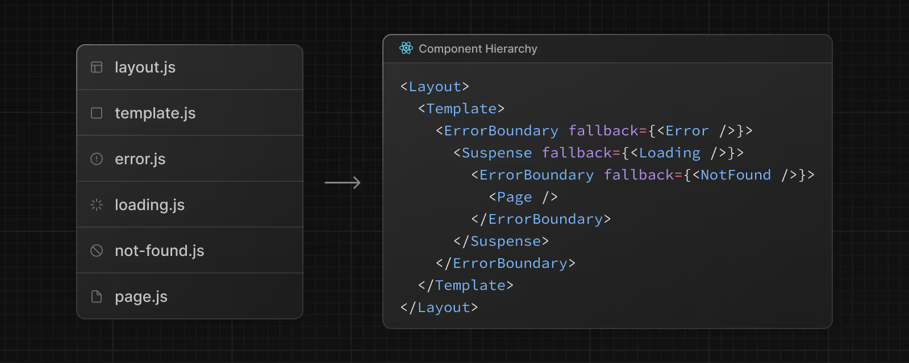

# Payload CMS & NextJS App Router

This article briefly describes the setup of the `elearning` @DF repository, which is based on [Payload CMS](https://payloadcms.com/) and [NextJS](https://nextjs.org/), and some relevant lessons learned during its development. The main advantages of this setup are a shared NextJS app between the content management system (CMS) and the client application, allowing to provide features like a live preview of the content.

An alternative example for a similar setup is [Netlify CMS](https://www.netlify.com/) (used in the background of [https://www.div.uzh.ch](https://www.div.uzh.ch)). However, since Netlify stores its data in simple Markdown files (through Git access and commits to the repository), it is not as powerful as Payload CMS.

Disclaimer: The code snippets in this article are not from a real project and might therefore not be 100% accurate and runnable in a real project. They are meant to illustrate the concepts and ideas behind the setup.

## 1. Payload CMS

Common CMS setups rely on a database to store content and two separate frontends. While the first frontend is what is usually known as the CMS and is used to manage the content, the second frontend is the actual client application that displays the content to the end-users. Payload CMS does not follow this pattern, but combines the CMS and the client application into a single app instead, adding end-to-end Typescript support, live preview, and other features.

### Concept (Single App Setup)


Figure 1: Illustration of Payload CMS setup

### Structure & Type-Safety

As already mentioned in the introduction and illustrated in Figure 1, the shared NextJS application allows for the seemless integration of the CMS and the client application. Shared access to the same SQL database adds possibilities to design an interactive client application, which would not be possible with simpler approaches like the Markdown-based Netlify CMS.

In the codebase, payload and the client application are separated into two directories according to the structure shown below. The database schema is defined through the `payload.config.ts` file, which imports the necessary information for the tables from the `collections` folder in our setup. Since Payload is using [Drizzle](https://orm.drizzle.team/) behind the scenes, it also natively supports migrations. In the connection with data seeding, the code needs to be carefully designed in order to avoid the deletion of existing data (see [data seeding section](#data-seeding)).

Type-safety will be automatically provided by Payload through the use of its [local API](#frontend-queries) for querying in the client applicaiton and the enforced structure for the definition of collections.

```plaintext
src
├── app
│   ├── (app) (client application)
│   ├── (payload) (CMS frontend)
│   ├── actions
│   ├── api
├── components
├── i18n (internationalization)
├── lib (utility content)
├── migrations
├── payload
│   ├── access
│   ├── collections
│   ├── ...
├── seed
├── middleware.ts
├── payload.config.ts
├── payload.types.ts (auto-generated)
```

### Collections & Database Structure

In Payload CMS applcations, collections are used to define the structure of the database tables and the fields thereon. In addition to the standard SQL database fields, Payload also supports numerous [custom fields](https://payloadcms.com/docs/fields/overview). Most of these fields do not have an equivalent representation in SQL databases, wherefore payload creates additional tables with relations between them in the background. This can lead to challenges when seeding / querying / modifying data and needs to be carefully considered. Inspecting the created database structure through tools like [DataGrip](https://www.jetbrains.com/datagrip/) is highly recommended. To connect to the database, the following configuration can be used:



Figure 2: Database connection setup in DataGrip

An example persons collection with a string name, a number age, an array field of skills (with a string name and number level) and a relation to a children collection could look like this:

```typescript
// collections/persons.ts

export const Persons: CollectionConfig = {
  dbName: "person",
  slug: "persons",
  access: {
    admin: authenticated,
    create: authenticated,
    delete: authenticated,
    read: authenticated,
    update: authenticated,
  },
  admin: {
    defaultColumns: ["name"],
    useAsTitle: "name",
  },
  fields: [
    {
      name: "name",
      type: "text",
      required: true,
      unique: true,
    },
    {
      name: "age",
      type: "number",
      required: true,
    },
    {
      name: "skills",
      type: "array",
      fields: [
        {
          type: "text",
          name: "name",
          required: true,
        },
        {
          type: "number",
          name: "level",
          required: false,
        },
      ],
    },
    {
      name: "children",
      type: "relationship",
      hasMany: true,
      relationTo: "children",
    },
  ],
  timestamps: true, // automatically add createdAt and updatedAt timestamps to the database entries
}
export default Persons
```

In the database structure, a new table will be created that includes the `id`, `name` and `age` of each person. Behind the scenes, Payload will create a separate table with all `skills` of one person, creating separate entries for each skill, all linked to the person through its `id`.

All collections that should be created as tables in the database by Payload then have to be included in the `payload.config.ts` file, which also includes configuration properties for the lexical editor (richtext support), the database connection settings, and more:

```typescript
// payload.config.ts

export default buildConfig({
  collections: [Persons, Children],
  editor: lexicalEditor({
    features: () => {
      return [
        UnderlineFeature(),
        BoldFeature(),
        ItalicFeature(),
        OrderedListFeature(),
        UnorderedListFeature(),
        LinkFeature(),
        HTMLConverterFeature(),
        HeadingFeature(),
        UploadFeature(),
      ]
    },
  }),
  secret: process.env.PAYLOAD_SECRET as string,
  typescript: {
    outputFile: path.resolve(dirname, "payload-types.ts"),
  },
  db: postgresAdapter({
    pool: {
      connectionString: process.env.DATABASE_URI,
    },
  }),
  sharp,
  localization: {
    locales: ["de", "en"],
    defaultLocale: "de",
    fallback: true,
  },
  admin: {
    user: Users.slug,
    autoLogin: {
      email: process.env.TEST_USER_EMAIL,
      password: process.env.TEST_USER_PASSWORD,
      prefillOnly: true,
    },
  },
  endpoints: [],
})
```

Whenever a collection is modified and Payload is running in development mode, the types in `payload.types.ts` will be directly updated to be consistent with the database schema, guaranteeing type safety across the entire application.

### Localization and Versions

Payload natively also supports localization and versioning. To activate localization, it is sufficient to simply add a prop `localized: true` to the corresponding collection property. In the background, payload will then create a separate table `persons_locales` (if a localized prop has been added to the `persons` collection), which contains all the attributes with multiple language values.

Similarly, Payload automatically takes care of a rigorous versioning logic, allowing to switch back to previously published versions of the same content through the CMS interface. The corresponding data ist stored in separate tables with a `_v` suffix.

### Migrations

When an application with a Payload CMS has been deployed, changes to the database schema should be done through migrations. Through its use of `Drizzle`, Payload provides a simple interface to create and run migrations.

However, it is important to mention that not only the SQL migration and their execution order are tracked, but that a complete copy of the database schema at this point in time is stored alongside the migration. This copy is used to identify changes between two successive migrations and create new ones. It is therefore essential to ensure that the migrations are merged into the developement / main branch in the correct order and fully sequentially. Otherwise, it is possible that a later migration re-adds some of the migration steps to the SQL migration file and cause errors during application.

To list all the existing migrations and check which of them have already been applied to the database, run the following command:

```bash
pnpm run payload migrate:status
```

To apply all pending migrations to the current database, run the following command:

```bash
pnpm run payload migrate
```

To create a new migration based on the changes between the current database schema and the copy generated during the previous migration, run the following command:

```bash
pnpm run payload migrate:create <migration-name>
```

### Relations & Hooks

At the point of writing payload only supports one-directional relations, which can be specified as shown in section [Collections & Database Structure](#collections--database-structure). To create bi-directional relations, one-directional relations need to be defined for both considered collections and a custom hook (called `updateRelationshipRefs` is required to keep them in sync).

More generally, Payload supports a significant range of hooks that can be specified as part of the collections and run in certain cases. They can be used to update derived data that should be stored in the database for simplified querying or to update related tables with new data.

```typescript
// collections/children.ts

export const Children: CollectionConfig = {
  dbName: "child",
  slug: "children",
  access: {
    admin: authenticated,
    create: authenticated,
    delete: authenticated,
    read: authenticated,
    update: authenticated,
  },
  admin: {
    defaultColumns: ["name"],
    useAsTitle: "name",
  },
  fields: [
    {
      name: "name",
      type: "text",
      required: true,
      unique: true,
    },
    {
      name: "parents",
      type: "relationship",
      hasMany: true,
      relationTo: "persons",
    },
  ],
  hooks: {
    afterChange: [
      // example custom hook to update bi-directional relations
      updateRelationshipRefs<Children, Persons>({
        relationshipId: "persons",
        sourceFieldName: "parents",
        targetFieldName: "children",
      }),
    ],
  },
}
export default Persons
```

### Client Application Queries & Mutations

To access data from the database, while still guaranteeing type safety, Payload provides a local API that can be used in the client application. Intuitive properties allow to specify the depth of the joins that should be considered and other settings. The following example shows how to query the database for a specific person and their children:

```typescript
import { localApi } from "~/lib/api"

const person = await localApi.findByID({
  collection: "persons",
  id: 0,
  depth: 1,
  draft: false,
})

// ✅ get the name (success)
const person = person.name

// ❌ type error
const occupation = person.occupation
```

For this to work, make sure that the corresponding API has been set up correctly in the `src/lib/api.ts` file

```typescript
import config from "@payload-config"
import { PayloadApiClient } from "@payload-enchants/sdk"
import { getPayloadHMR } from "@payloadcms/next/utilities"
import { Config } from "~/payload-types"

export const api = new PayloadApiClient<Config>({
  apiURL: "http://localhost:3000/api",
})

export const localApi = await getPayloadHMR({ config })
```

Similarly, data can be updated through the local API. For example, changing the name of a person with the id 0 to "John Doe" would look like this:

```typescript
import { localApi } from "~/lib/api"

await localApi.update({
  collection: "persons",
  id: 0,
  data: {
    name: "John Doe",
  },
})
```

### Data Seeding

When seeding data into a database that is running behind a payload CMS, it is very important to closely pay attention to the logic that is required for incremental seeding. Only collections defined as such in the `payload.config.ts` file will be assigned an id that can be used for reference during querying / updating. Entries in derived tables (such as lines in an `array` or `block` field) are assigned ids behind the scenes, but are exposed as nullable fields and cannot be set during the seeding process.

Accordingly, if these ids are used in some context, for example to track skills that children have learned form their parents (while `skills` are defined as an `array` field on the `persons` collection), the seeding logic needs to track additional identifiers or requires custom hooks that update the linked entries based on the previous and new documents. In the context of the `eLearning` application, this applies for exmample to the tracking of `learning objectives` stored on the `course-units` collection and their completion tracked on the `students` collection.

## 2. NextJS App Router

### Structure: Server and Client Separation

The main concept that needs to be understood when working with the new NextJS App directory is the clear separation of server and client components. By default, any component that does not have anything else specified will be rendered as a server component, which are sent in a rendered format to the client and do not allow for any interaction.

Client components on the other hand, marked through `use client` at the top of the file are rendered on the client, can include hooks and other client-side logic, but cannot access the database or any other server-side logic and resources. This clear separation allows for a more efficient rendering of the application and a better user experience.

### Routing & Layouts



Figure 3: NextJS App directory structure (Soruce: NextJS Documentation)

Pages that should be reachable through a corresponding route need to be defined within the `app` directory as `page.tsx`. The folder structure that leads to this file determines the path under which the page will be reachable. In addition to the page itself, the app directory also supports the use of several additional components that are rendered around the page and nested for hierarchical folder structures (Figure 3). This allows for minimal updates when switching to a different page further down the tree and to minimize the amount of required updates.

Similar to the pages router, the app router still supports dynamics routes. On the `page.tsx` component itself, the corresponding parameters are directly available as `props`. On client components included on the page, all parameters can be accessed through the `useParams` hook (manual typing required). For server components that are included on the page, the required parameters needs to be passed down.

```plaintext
src
├── app
│   ├── (app)
│   |   ├── (content)
│   |   |   ├── person
│   |   |   |   ├── [id]
│   |   |   |   |   ├── page.tsx
│   |   |   |   |   ├── layout.tsx
├── components
│   ├── Person.tsx
│   ├── SkillInput.tsx
```

```typescript
// (app)/(content)/person/[id]/layout.tsx

async function Layout({
  children,
  params,
}: Readonly<{
  // ✅ paramaters accessible through props
  params: {
    id: string
  }
  children: React.ReactNode
}>) {
  const person = localApi.findByID({
    collection: "persons",
    id: params.id,
    depth: 1,
    draft: false,
  })

  return (
    <div>
      <h1>Person {params.name}</h1>
      {children}
    </div>
  )
}
```

```typescript
// (app)/(content)/person/[id]/page.tsx
// accessible through /person/0 (or other id)

export default function PersonPage() {
  const person = localApi.findByID({
    collection: "persons",
    id: params.id,
    depth: 1,
    draft: false,
  })

  return (
    <div>
      <Person age={person.age} />
    </div>
  )
}
```

```typescript
// components/Person.tsx

export default function Person({ age }: { age: number }) {
  // ❌ useParams not available in server components
  // const { id } = useParams()

  return (
    <div>
      <div className="font-bold">Age: {age}</div>
    </div>
  )
}
```

```typescript
// components/SkillInput.tsx
'use client'

export default function SkillInput() {
  const [skill, setSkill] = useState("")

  // ✅ useParams available in client components
  const { id } = useParams<{id: string}>()

  return (
    <div>
      <div>Skills of Person {id}</div>
      <input
        type="text"
        value={skill}
        onChange={(e) => setSkill(e.target.value)}
      />
    </div>
  )
}
```

### Server Actions

For users to be able to interact with the application, it is essantial that user actions can trigger changes in the database. To achieve this, the server actions need to be defined in the `src/app/actions` directory. These actions can then be called from the client components and will be executed on the server. The result of the action can then be passed back to the client and used to update the UI.

```typescript
// src/app/actions/addSkill.ts
"use server"

export async function addSkill({ personId, hobby }: { personId: string; hobby: string }) {
  const person = await localApi.findByID({
    collection: "persons",
    id: personId,
    depth: 1,
    draft: false,
  })

  await localApi.update({
    collection: "persons",
    id,
    data: {
      skills: [...person.hobbies, { name: hobby }],
    },
  })

  return { success: true }
}
```

These functions can then be called from client components to update the data stored in the database:

```typescript
// components/SkillInput.tsx
import { addSkill } from "~/app/actions/addSkill"

export default function SkillInput() {
  const [skill, setSkill] = useState("")
  const { id } = useParams<{id: string}>()

  return (
    <div>
      <div>Add new Skill for Person {id}</div>
      <input
        type="text"
        value={skill}
        onChange={(e) => setSkill(e.target.value)}
      />
      <button onClick={() => addSkill({ personId: id, skill })}>Add Skill</button>
    </div>
  )
}
```

## 3. Caching

To increase the efficiency of the app and make use of server side rendering and caching wherever possible, server-side and client-side caching techniques have been successfully combined in the `eLearning` project. For server-side caching, the `unstable_cache` by NextJS is used in combination with `useSWR` for client side caching.

### Server-Side Caching

Server side caching with `unstable_cache` requires the definition of a suitable cache key, which needs to be invalidated as soon as the data is changed either through the CMS or through a client action, triggering a corresponding mutation.

```typescript
// app/actions/person.ts
import { unstable_cache } from "next/cache"

export function getCachedPerson({ personId }: { personId: number }) {
  return unstable_cache(() => getPerson({ personId }), [personId], {
    tags: [`person-${personId}`, `cms-person-${personId}`],
  })
}
```

With the corresponding server function being defined as:

```typescript
// app/action/person.server.ts
"use server"

import { Person } from "~/payload-types"

export async function getPerson({ personId }: { personId: number }) {
  const result = await localApi.findByID({
    collection: "persons",
    id: personId,
  })

  return result
}
```

The data can then be fetched on a server component by simply importing and using this function:

```typescript
// (app)/(content)/person/[id]/page.tsx

export default function PersonPage({ personId: number }) {
  const getCourse = getCachedPerson({ personId: number })
  const course = await getPerson()

  return (
    <div>
      <Person age={person.age} />
    </div>
  )
}
```

To invalidate the cached data, the `revalidateTag` function can be called from the server functions where the persons entry is modified (snippet 1) and in the `afterChange` hook on the payload collection (snippet 2).

```typescript
// src/app/actions/addSkill.ts
"use server"

import { revalidateTag } from `next/cache`

export async function addSkill({ personId, hobby }: { personId: string; hobby: string }) {
  [...]

  // ✅ invalidate cache
  revalidateTag(`person-${personId}`)

  return { success: true }
}
```

```typescript
// collections/persons.ts

export const Persons: CollectionConfig = {
  dbName: "person",
  slug: "persons",
  access: {...},
  fields: [...],
  // ✅ invalidate cache on change
  afterChange: [
      async ({ doc }) => {
        try {
          revalidateTag(`cms-person-${doc.id}`)
        } catch (e) {
          console.error(e)
        }
      },
    ],
}
export default Persons
```

### Client-Side Caching

To cache the fetched course data locally on the client, the following code can be used. The `useSWR` hook will automatically fetch the data from the server and store it until the specified `tag` has been invalidated, triggering a refetch of the data (similar to server-side caching, tags are not synchronized though).

```typescript
// app/actions/useCachedPerson.ts
"use client"

export function useCachedPerson({ personId, suspense }: { personId: number; suspense?: boolean }) {
  const jwt = useAuthToken()

  return useSWR(
    "swr-person",
    () =>
      getCachedPerson({
        personId,
        jwt,
      }),
    {
      suspense,
    },
  )
}
```

Data cached through SWR can be directly accessed in the client components:

```typescript
// components/Person.tsx
'use client'

export default function Person() {
  const params = useParams<{ personId: string }>()
  const { data: bookmarkExists } = useCachedPerson({
    personId: parseInt(params.personId),
    suspense: true,
  })

  return (
    <Suspense>
      <div className="font-bold">Age: {age}</div>
    </Suspense>
  )
}
```

In order to properly update the SWR cache after changes through the end-user, the mutation action is typically called within a `useSWRMigration` hook, which will automatically update the cache after the mutation has been executed.

```typescript
// components/SkillInput.tsx
import { addSkill } from "~/app/actions/addSkill"

export default function SkillInput() {
  const [skill, setSkill] = useState("")
  const { id } = useParams<{id: string}>()

  const { trigger: triggerAddSkill } = useSWRMutation(
    'addSkill',
    addSkill,
    {
      onSuccess: () => {
        // ✅ invalidate cache
        mutate((key: string | undefined) => key?.includes('swr-person'))
      },
    },
  )

  return (
    <div>
      <div>Add new Skill for Person {id}</div>
      <input
        type="text"
        value={skill}
        onChange={(e) => setSkill(e.target.value)}
      />
      {/* // ✅ trigger SWR mutation instead of server action directly */}
      <button onClick={() => triggerAddSkill({ personId: id, skill })}>Add Skill</button>
    </div>
  )
}
```
